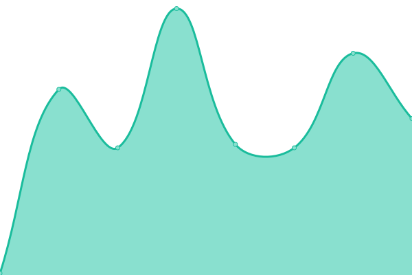

# [📈 Live Status](https://TimyIsCool.github.io/uptime-stuff): <!--live status--> **🟧 Partial outage**

This repository contains the open-source uptime monitor and status page for [TimyIsCool](https://TimyIsCool.github.io/uptime-stuff), powered by [Upptime](https://github.com/upptime/upptime).

With [Upptime](https://upptime.js.org), you can get your own unlimited and free uptime monitor and status page, powered entirely by a GitHub repository. We use [Issues](https://github.com/TimyIsCool/uptime-stuff/issues) as incident reports, [Actions](https://github.com/TimyIsCool/uptime-stuff/actions) as uptime monitors, and [Pages](https://TimyIsCool.github.io/uptime-stuff) for the status page.

<!--start: status pages-->
<!-- This summary is generated by Upptime (https://github.com/upptime/upptime) -->
<!-- Do not edit this manually, your changes will be overwritten -->
<!-- prettier-ignore -->
| URL | Status | History | Response Time | Uptime |
| --- | ------ | ------- | ------------- | ------ |
|  [TG's Site](http://timyg.org) | 🟥 Down | [tg-s-site.yml](https://github.com/TimyIsCool/uptime-stuff/commits/HEAD/history/tg-s-site.yml) | 

 0ms
     
 | 

<a href="https://TimyIsCool.github.io/uptime-stuff/history/tg-s-site">0.00%</a>
    

|  [Discord](https://discord.com) | 🟩 Up | [discord.yml](https://github.com/TimyIsCool/uptime-stuff/commits/HEAD/history/discord.yml) | 

 60ms
     
 | 

<a href="https://TimyIsCool.github.io/uptime-stuff/history/discord">100.00%</a>
    

|  [Main Pool Site](http://rtm.timyg.org) | 🟩 Up | [main-pool-site.yml](https://github.com/TimyIsCool/uptime-stuff/commits/HEAD/history/main-pool-site.yml) | 

 439ms
     
 | 

<a href="https://TimyIsCool.github.io/uptime-stuff/history/main-pool-site">100.00%</a>
    

<!--end: status pages-->

[**Visit our status website →**](https://TimyIsCool.github.io/uptime-stuff)

## 📄 License

- Powered by: [Upptime](https://github.com/upptime/upptime)
- Code: [MIT](./LICENSE) © [TimyIsCool](https://TimyIsCool.github.io/uptime-stuff)
- Data in the `./history` directory: [Open Database License](https://opendatacommons.org/licenses/odbl/1-0/)
